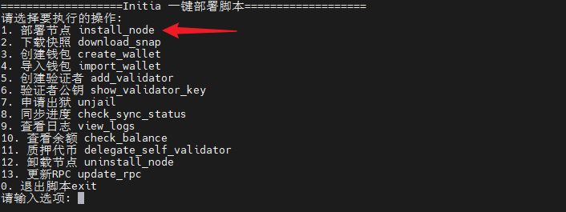

# Initia 节点一键部署教程


Initia是一个用于全链 Rollup 网络，通过将新颖的 L1 与特定于应用程序的 L2 基础设施系统融合而构建。Initia 平台提供产品就绪的 Rollup，使团队能够构建可扩展的主权系统，同时消除最终用户在与模块化多链宇宙交互时面临的用户体验复杂性。Initia 拥有完整的技术堆栈，可实现一套链级机制，使用户、开发者、L2 应用链和 L1 之间的经济利益保持一致。Initia 已完成 750 万美元种子轮融资。

**【推荐配置】：4C 16G 1T SSD**

### 1、下载 Initia 节点一键部署脚本

```bash
wget -O initia.sh https://raw.githubusercontent.com/nodesyncer/Initia/main/initia.sh && chmod +x initia.sh && ./initia.sh
```

### 2、输入选项 1，部署节点



### 3、输入选项 2，下载快照

### 4、输入选项 8，查看同步进度

### 5、输入选项  3，创建钱包

### 6、领水后输入选项  5，创建验证者

1. 在 [谷歌商店](https://chromewebstore.google.com) 搜索并安装 `Initia wallet` 钱包插件并创建钱包
2. 创建成功后去 https://faucet.testnet.initia.xyz/ 领水
3. 等待钱包有钱且选项 8 的同步状态为 false 后，执行 5 创建验证者
4. 在 [区块浏览器](https://scan.testnet.initia.xyz/initiation-1) 查看验证者是否创建成功

### 7、质押代币

成为验证后，可以进行代币质押，质押后可以进入 https://testnet.itrocket.net/initia 进行查看

节点部署完毕！
